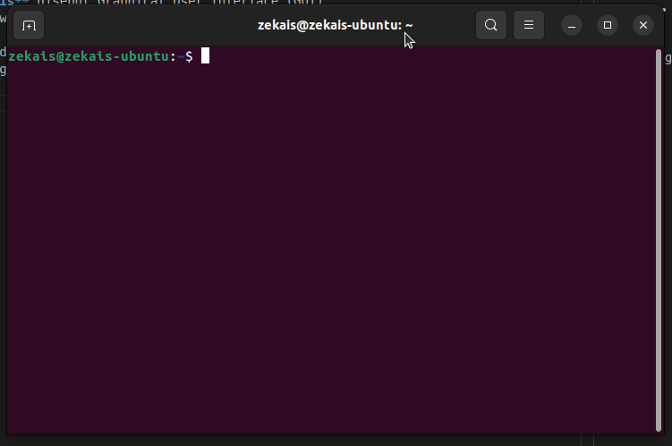
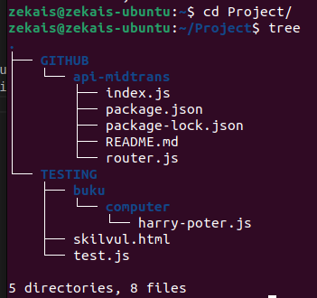
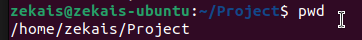
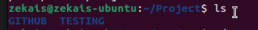
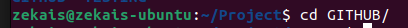
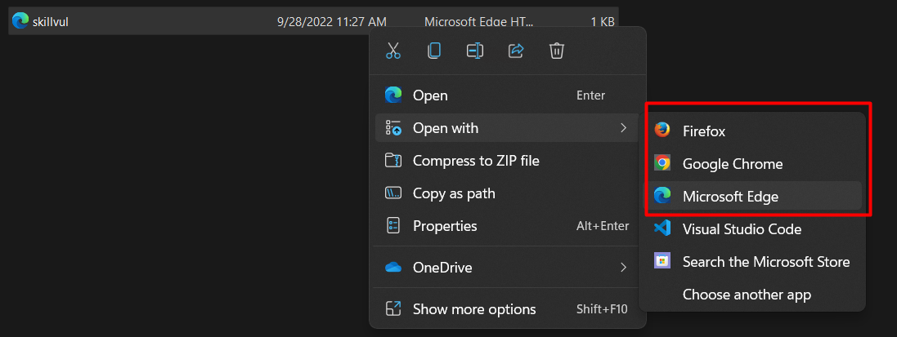
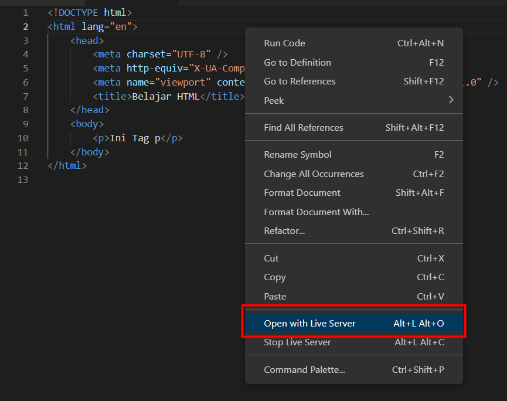
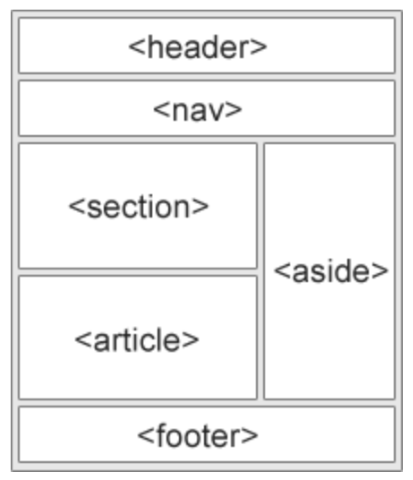
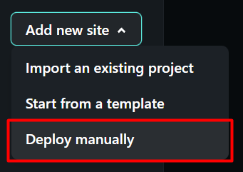
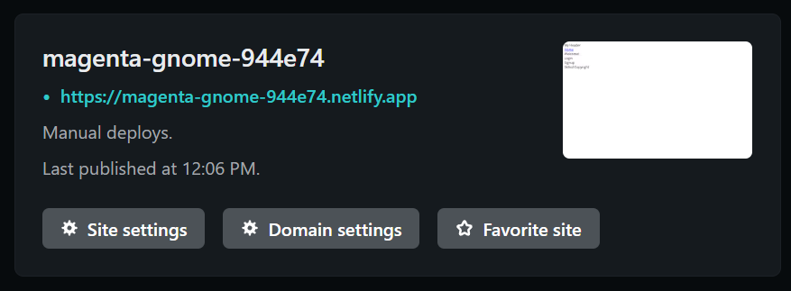

# **Writing and Presentation Week 1**

## **UNIX COMMAND LINE**

#### **Shell**

Adalah Program yang menerima perintah dan meneruskan perintah tersebut untuk dieksekusi oleh sistem.

-   Shell berbasis **Text** disebut Command Line Interfrace (CLI)

    -   Contoh CLI : sh, bash, zsh, cmd.exe

-   Shell berbasis **Grafis** disebut Graphical User Interface (GUI)

    -   Contoh GUI : Windows, MacOS

**Mengakses Terminal** bisa dengan menekan tombol keyboard **ctrl + alt + t** (Linux) Sehingga Muncul Terminal Seperti gambar dibawah ini.

<div align="center">
    
</div>

#### **Filesystem**

Sebuah Filesystem mengatur bagaimana data disimpan di dalam sebuah system. Sistem operasi Windows & Unix-like menyusun file dan direktori menggunakan struktur yang bentuknya mirip tree seperti gambar dibawah.

<div align="center">
    
</div>

#### **Perintah yang sering digunakan**

##### **Command Navigasi**

-   Melihat current working directory `pwd`

    ```bash
    pwd
    ```

    

-   Melihat isi yang ada di direktori `ls`

    ```bash
    ls
    ```

    

-   Untuk berpindah direktori `cd <direktori>`

    ```bash
    cd GITHUB/
    ```

    

#### **Command Direktori & File**

-   Melihat Isi File

    -   Melihat isi **Keseluruhan** File `cat <nama file>`

    ```bash
    cat index.js
    ```

    -   Melihat isi beberapa **Line Awal** File `head <nama file>`

    ```bash
    head index.js
    ```

    -   Melihat isi beberapa **Line Akhir** File `tail <nama file>`

    ```bash
    tail index.js
    ```

-   Membuat File & Direktori

    -   Membuat sebuah **File** `touch <nama file>`

    ```bash
    touch README.md
    ```

    -   Membuat sebuah **Direktori** `mkdir <nama direktori>`

    ```bash
    mkdir belajar-git
    ```

-   Untuk Menyalin File & Direktori

    -   Menyalin sebuah **File** `cp <nama file> <location>`

    ```bash
    cp index.js ..
    ```

    -   Menyalin sebuah **Direktori** `cp -r <nama direktori> <location>`

    ```bash
    cp -r belajar-git ../skilvul
    ```

-   Untuk Memindahkan atau Me-Rename File dan Direktori

    -   Memindahkan atau Me-Rename Sebuah **File** `mv <nama file> <location>`

    ```bash
    mv index.js ..
    ```

    -   Memindahkan atau Me-Rename Sebuah **Direktori** `mv -r <nama direktori> <location>`

    ```bash
    mv -r belajar-git ../skilvul
    ```

-   Untuk Menghapus File dan Direktori

    -   Menghapus sebuah **File** `rm <nama file>`

    ```bash
    rm index.js
    ```

    -   Menghapus sebuah **Direktori** `rm -r <nama direktori>`

    ```bash
    rm -r belajar-git
    ```

## **GIT & GITHUB**

### **GIT**

Git merupakan sebuah tools sebagai Version Control System yang berarti untuk mencatat setiap perubahan file pada suatu proyek yang dikerjakan sejara individu atau berkelompok.

### **GITHUB**

GitHub merupakan sebuah cloud base yang digunakan untuk mengupload atau mengelola sebuah file.

Git dan Github adalah tools yang wajib digunakan oleh programmer khususnya saat sedang berkolaborasi dengan tim. Karena dengan Git dan Github mempermudah programmer dalam menyimpan file project bersama dan dapat melacak setiap perubahan yang terjadi pada file-file tersebut. Selain itu juga tidak perlu menunggu rekan dalam satu tim menyelesaikan suatu task dahulu untuk berkolaborasi, sehingga mempercepat menyelesaikan sebuah project dalam tim.

### **Alur Kerja Menggunakan Git & Github**

1. Install GIT

    - Cek Apabila GIT Sukses Terinstall dengan perintah
        ```bash
        git --version
        ```

2. Setup Awal `username` dan `email` GIT Menggunakan perintah `git config`

    Contoh.

    ```bash
    git config --global user.name "zekais"
    git config --global user.email "zekais@gmail.com"
    ```

    Apabila Ingin Cek Setup github dengan perintah

    ```bash
    git config --list
    ```

3. Membuat Repositori Github, Bisa Langsung Melalui Website github.com
   

4. Membuat Folder Kosong di local, kemudian melakukan init dengan perintah

    ```bash
    git init .
    ```

5. Untuk Menghubungkan Folder Local dengan Repositori yang ada di Github bisa melakukan Remote, dengan perintah.

    ```bash
    git remote add origin <url repo github.git>
    ```

    Setup Branch ke `MAIN` dengan perintah

    ```bash
    git branch -M main
    ```

6. Selanjutnya Menambahkan File atau Folder baru di local, bisa dengan perintah `mkdir` atau `touch`
7. Untuk mengupload ke github kembali dengan perintah.
    ```bash
    git add .
    ```
8. Setelah itu Jika dirasa semua sudah sesuai bisa melakukan commit dengan perintah.
    ```bash
    git commit -am "Ini Pesan Commit"
    ```
9. Agar terpublish di Github melalui perintah.
    ```bash
    git push origin main
    ```

## **HTML (HyperText Markup Language)**

HTML (Hypertext Markup Language) adalah bahasa markup yang digunakan untuk membuat halaman website. Isinya terdiri dari berbagai kode yang dapat menyusun struktur suatu website. Adapun **Peran** HTML iala hsebagai kerangka suatu website yang menampilkan konten pada browser.

#### **Tools Pendukung Dalam Menggunakan HTML**

-   Browser dan Code Editor
-   Extensi Live Server Untuk Melihat HTML secara Realtime di browser
-   Extensi Prettier Untuk code formatter atau extensi untuk merapikan kode HTML

#### **Membuat HTML Sederhana**

Dengan Menggunakan VSCode bisa menuliskan tanda `!` + `enter` pada file html maka otomatis akan mengenerate HTML sederhana dengan terdapat struktur `<html>` `<head>` `<title>` dan `<body>`

```html
<!DOCTYPE html>
<html lang="en">
	<head>
		<meta charset="UTF-8" />
		<meta http-equiv="X-UA-Compatible" content="IE=edge" />
		<meta name="viewport" content="width=device-width, initial-scale=1.0" />
		<title>Document</title>
	</head>
	<body>
		Testo
	</body>
</html>
```

#### **Menjalankan File HTML**

**1. Secara Manual**
Dengan langsung membuka seperti gambar dibawah ini.

<div align="center">
    
</div>

**2. Menggunakan Extensi Live Server**
Dengan Extensi Live Server seperti gambar di bawah ini.

<div align="center">
    
</div>

#### Implementasi Tag HTML Yang Populer

**1. Image `img`**

Berfungsi untuk menyisipkan Gambar (Berupa File atau URL)

```html

```

**2. Video `video`**

Berfungsi untuk menyisipkan Video (Berupa File atau URL)

```html
<video controls>
	<source src="movie.mp4" type="video/mp4" />
</video>
```

**3. Tabel `table`**

Berfungsi untuk membuat sebuah tabel

```html
<table>
	<tr>
		<th>Company</th>
		<th>Contract</th>
		<th>Country</th>
	</tr>
	<tr>
		<td>Asep</td>
		<td>628xx</td>
		<td>Indonesia</td>
	</tr>
	<tr>
		<td>Bambang</td>
		<td>551xx</td>
		<td>Brazil</td>
	</tr>
</table>
```

**4. Form `form`**

Berfungsi untuk menampung inputan pada HTML

```html
<form>
	<input type="text" name="username" id="username" placeholder="Username" />
</form>
```

#### **Semantic HTML**

Semantic HTML ialah menggunakan element html yang sesuai dengan kebutuhan konten. Adapun Kegunaan Lain Semantic HTML.

-   Meningkatkan Accessibility
-   Meningkatkan SEO
-   Lebih mudah di maintain

Beberapa Contoh Semantic HTML `<header>`, `<nav>`, `<section>`, `<aside>`, `<article>`, `<footer>`

<div align="center">
    
</div>

#### **Deploy HTML**

Deploy HTML Menggunakan Hosting Gratis yang disediakan Oleh [Netlify](https://www.netlify.com/)

1. Register & Sign In Akun Netlify
2. Add New Site (Saya Memilih Deploy Manual)

 

3. Browse atau Drag & Drop Folder Yang Akan di Deploy

 

4. Jika Berhasil, Maka akan muncul tampilan seperti berikut.

 

## **CSS (Cascading Style Sheets)**

CSS adalah bahasa yang digunakan untuk mendesain halaman website.

Dengan CSS, kita bisa mengubah warna, menggunakan font custom, editing text format, mengatur tata letak, dan lainnya.

#### **Beberapa Cara Menyisipkan CSS ke Dalam HTML**

**1. Inline Styles**
Inline styles adalah menambahkan CSS pada attribute element HTML

```html
<p style="color: coral; font-size: 36px">This paragraph using inline styles</p>
```

**2. Internal Styles**
Internal Styles adalah menambahkan CSS dengan tag `<style>` pada halaman HTML

```html
<style>
	p {
		color: BLUE;
	}
</style>
```

**3. External Styles**
External Styles adalah menambahkan CSS dengan memisahkan dari HTML, dan dihubungkan pada halaman HTML dengan tag dibawah ini.

```html
<link rel="stylesheet" href="style.css" />
```

#### **Sintaksis Dasar CSS**

**1. CSS Tag Name**
Penggunaan styling ini bersifat global yang mempengaruhi seluruh tag HTML yang dipanggil menggunakan CSS.

`HTML`

```html
<h1>Ini Title</h1>
```

`CSS`

```css
h1 {
	color: green;
}
```

**2. CSS Class Name**
HTML yang memiliki class yang sama, akan mempunyai styling yang sama saat digunakan pada CSS

`HTML`

```html
<div class="class-sidebar">Ini Class Sidebar</div>
```

`CSS`

```css
.class-sidebar {
	color: green;
}
```

**3. CSS Multiple Class**
Styling Menggunakan lebih dari 1 class yang berbeda untuk 1 element HTML

`HTML`

```html
<div class="class1 class2">Ini Class Sidebar</div>
```

`CSS`

```css
.class1 {
	color: red;
}

.class2 {
	text-transform: lowercase;
}
```

**4. CSS ID Name**
Styling dengan menggunakan atribut id. Atribut id bernilai uniq. Jadi hanya akan ada 1 nama id pada elemen HTML.

`HTML`

```html
<div id="id-1">Ini pakai ID</div>
```

`CSS`

```css
#id-1 {
	color: green;
}
```

#### **Box Model**

Pada dasarnya setiap elemen di HTML dapat dianggap sebagai “box”. Yaitu, sebuah “box” yang membungkus elemen secara keseluruhan. Box tersebut terdiri dari beberapa bagian, yaitu ; margin, border, padding, dan content

-   Content : adalah konten dari elemen, biasanya berupa teks atau gambar
-   Border : bagian perantara antara inner space dan outer space dari content
-   Padding : inner space pada content element
-   Margin : outer space atau bisa dibilang bagian terluar dari element

#### **Position**

Position pada CSS di gunakan untuk mengatur posisi sebuah element HTML. Jika kita ingin membuat atau menetapkan posisi sebuah element dengan element yang lain. maka dengan menggunakan property position CSS ini kita dapat menentukan posisi sebuah element HTML sesuai dengan yang kita inginkan.

-   Static : Default position yang merupakan lapisan paling bawah.
-   Relative : Lapisan diatas static yang dapat kita beri properti top, left, right, bottom untuk dapat berpindah-pindah dari posisi awal.
-   Absolute : Lapisan position yang akan mengikuti relative parent terdekat dan menempel diatasnya.
-   Fixed : Lapisan Position mutlak yang tidak akan berubah dan relatif terhadap viewport
-   Sticky : Lapisan position yang akan berubah menjadi fixed saat kita melakukan scrolling.

#### **FlexBox**

-   Flexbox adalah suatu cara untuk mengatur layout atau tata letak.
-   Flexbox terdiri 1 parent (container) dan bisa beberapa child.
-   Flex direction digunakan untuk mengatur letak child.
-   Flex wrap mengatur tata letak child pada 1 line.
-   Flex flow yaitu digunakan sebagai shortcut untuk set up - flex-direction dan flex-wrap secara bersamaan.
-   Order digunakan untuk ordering item yang ingin diatur posisinya.
-   Justify - content digunakan untuk mengatur tata letak antar item child secara horizontal.
-   Align - content digunakan untuk mengatur tata letak antar item child secara vertikal atau cross axis.
-   Flex-grow digunakan untuk mengatur size suatu item child pada flexbox
-   Flex-shrink digunakan untuk memperkecil size suatu item child secara relatif terhadap item child lainnya.
-   flex-basis digunakan untuk mengatur width setiap item child.

## **Algoritma**

Algoritma adalah deskripsi berupa step-step yang dibutuhkan untuk menyelesaikan suatu masalah.

Sedangkan struktur data merupakan langkah penyimpanan, pengorganisasian, dan pengaturan banyak data di dalam media penyimpanan komputer sehingga data-data tersebut dapat digunakan secara efisien

#### **Manfaat Algoritma Dan Data Structure**

Manfaat **Algoritma** :

-   Membuat program menjadi lebih sederhana dari sebelumnya.
-   Memudahkan dalam pembuatan program.
-   Mengatasi masalah logika secara terurut.
-   Meminimalisir penulisan program yang berulang-ulang.
-   Program menjadi lebih terstruktur dan rapih.
-   Dokumentasi lebih mudah.
-   Mudah untuk melakukan pemeliharaan.

Manfaat **Data Structure** :

-   Memudahkan untuk menyimpan dan mengatur data menjadi lebih efisien, rapih, dan terorganisir.
-   Memberikan informasi yang lebih cepat.
-   Meningkatkan efektivitas terhadap algoritma.
-   Mudah melakukan debugging.
-   Mengatur sumber daya dan layanan pada sistem.
-   Menciptakan kecepatan dalam pencarian data.
-   Menegelola big data sehingga terjamin kualitasnya.

#### **Membuat Algoritma Sederhana**

Berikut ini Adalah Algoritma Sederhana Sekaligus Menyelesaikan Masalah Mengidentifikasi Anga Ganjil Dan Genap.

```
1: Mulai
2: Deklarasi Module dan Variabel Angka
3: User Input Angka
4: Filter Jika Angka dibagi 2 tersisa 0 maka angka genap, Jika sisa 1 maka angka ganjil
5: Tampilan Output
6: Selesai
```

Dibawah ini adalah kode dari bahasa `JavaScript` Run Menggunakan `Node JS` hasil dari implementasi algortima sederhana diatas.

```js
const prompt = require("prompt-sync")();
let angka = 0;

angka = prompt("Input Angka : ");

if (angka % 2 == 0) {
	console.log(`${angka} Adalah Angka Genap`);
} else {
	console.log(`${angka} Adalah Angka Genap`);
}
```

## **JavaScript Dasar**

Javascript adalah bahasa pemograman yang sangat powerful yang digunakan untuk logic pada sebuah website. Javascript juga dapat membuat website menjadi interaktif dan dinamis

#### **Menjalankan JavaScript**

Javascript dijalankan melalui browser (Chrome, Mozilla, Edge) pada device setiap user. Umumnya browser Chrome dan Mozilla yang sudah support untuk semua fitur Javascript.

Untuk Menghubungkan Javascript ke browser ada 2 cara yakni Internal dengan menyisipkan tag `<script>` pada tag html

```html
<script>
	console.log("ini dari JS");
</script>
```

Dan kedua adalah external dengan memisahkan file HTML dengan File Javascript, kemudian dipanggil dengan tag `<script>`

`HTML`

```html
<script src="script.js"></script>
```

`JAVASCRIPT (script.js)`

```js
console.log("ini dari JS");
```

#### **Tipe Data Pada Javascript**

Tipe data di dalam JavaScript dibedakan menjadi 2 jenis yaitu tipe data primitif dan tipe data non primitif.

**1. Tipe Data Primitif**

-   `String`
    Tipe data bernilai teks yang dibuktikan dengan adanya tanda kutip 1/2, backtick

-   `Number`
    Tipe data bernilai angka

-   `Boolean`
    Tipe data ini akan bernilai kebenaran yaitu true (1) atau false (0)

-   `Undefined`
    Tipe data undefined adalah tipe data yang merepresentasikan varibel/data yang tidak memiliki nilai.

-   `Null`
    Tipe data yang tidak berisisi apa apa

**2. Tipe Data Non-Primitif**

-   `Object`
    Tipe data ini menyimpan sebuah nilai (properti) dan fungsi (method). Object bisa dibangun dengan mendeklarasikan variabel lalu diikuti dengan kurung kurawal {}. Di dalam kurung kurawal tersebut bisa terdiri dari berbagai macam tipe data lainya seperti String, Number, dan lain-lain

-   `Array`
    Tipe data ini hampir sama dengan Object yang dapat menyimpan banyak data dan beragam tipe data (untuk JavaScript dan bahasa pemrograman yang mendukung banyak data yang bisa menyimpan tipe data yang berbeda). Namun, tidak memiliki properti dan method, maka dari itu mendapatkan data dari array menggunakan indeks yang dimulai dari angka 0

-   `RegExp`
    Tipe data ini berbentuk string teks yang digunakan untuk mencari pola pencarian

#### **Operator Pada Javascript**

**1. Operator Aritmatika**

```
Operator (+) untuk penambahan
Operator (-) untuk pengurangan
Operator (*) untuk pengalian
Operator (**) untuk pangkat
Operator (/) untuk pembagian
Operator (%) untuk mencari hasil bagi
Operator (++) untuk menambahkan 1
Operator (--) untuk mengurangi 1
```

**2. Operator Penugasan**

```
Operator (=)   contoh : x = y
Operator (+=)  contoh (x += y) == (x = x + y)
Operator (-=)  contoh (x -= y) == (x = x - y)
Operator (*=)  contoh (x *= y) == (x = x * y)
Operator (/=)  contoh (x /= y) == (x = x / y)
Operator (%=)  contoh (x %= y) == (x = x % y)
Operator (**=) contoh (x **= y) == (x = x ** y)
```

**3. Operator Perbandingan**

```
Operator (==)   digunakan untuk membandingkan kesamaan sebuah nilai
Operator (===)  digunakan untuk membandingkan kesamaan sebuah nilai dan tipe data dari nilai
Operator (!=)   digunakan untuk membandingkan ketidaksamaan sebuah nilai
Operator (!==)  digunakan untuk membandingkan ketidaksamaan sebuah nilai dan tipe data dari nilai
Operator (>)    digunakan untuk membandingkan lebih besar
Operator (<)    digunakan untuk membandingkan lebih kecil
Operator (>=)   digunakan untuk membandingkan lebih besar atau sama dengan
Operator (<=)   digunakan untuk membandingkan lebih kecil atau sama dengan
Operator (?)    merupakan operator ternari
```

**4. Operator Logika**

```
Operator (&&)   logika AND
Operator (||)   logika OR
Operator (!)    logika NOT
```

**5. Operator Tipe**

```
Operator typeof       mengembalikan jenis tipe data
Operator instanceof   mengembalikan TRUE apabila bertipe objek
```

#### **Control Flow JavaScript**

**1. Looping**

Looping adalah statement yang mengulang sebuah instruksi hingga kondisi terpenuhi atau jika kondisi stop/berhenti tercapai. Berikut Ini cara Looping

-   For Loop
    Gunakan FOR LOOP jika diketahui seberapa banyak nilai pasti untuk pengulangannya.

    ```js
    let angka = 5;
    for (let i = 0; i < angka; i++) {
    	console.log(i);
    }
    ```

-   While Loop
    Gunakan WHILE LOOP jika tidak diketahui jumlah pasti pengulangan.

    ```js
    let angka = 1;
    while (angka <= 10) {
    	console.log(angka);
    	angka++;
    }
    ```

-   Do While Loop
    Jika ingin setidaknya menjalankan pengulangan 1 kali sebelum dilakukan pengecekan kondisi

    ```js
    let bensin = 9;
    do {
    	console.log("Nyalakan Mesin");
    	bensin--;
    } while (bensin > 0);
    ```

**2. Conditional**

Conditional merupakan statement percabangan yang menggambarkan suatu kondisi dan akan mengecek kondisi spesifik. Yang dicek adalah apakah kondisi tersebut TRUE (benar). Jika TRUE maka code didalam kondisi tersebut dijalankan.

-   if else

    ```js
    let angka = 1;
    if (angka == 1) {
    	console.log("Ini Benar");
    } else if (angka == 2) {
    	console.log("Ini Salah");
    } else {
    	console.log("Not Found");
    }
    ```

-   Switch Case

    ```js
    let angka = 1;
    switch (angka) {
    	case 1:
    		console.log("Ini Benar");
    		break;
    	case 2:
    		console.log("Ini Salah");
    		break;
    	default:
    		console.log("Not Found");
    }
    ```
