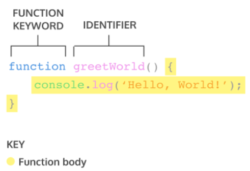
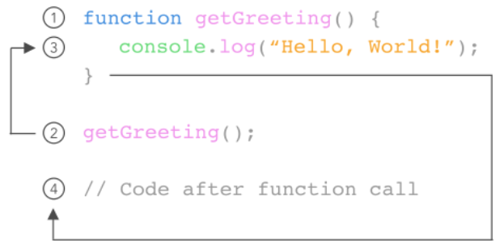
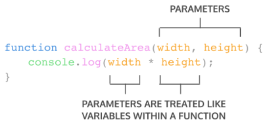
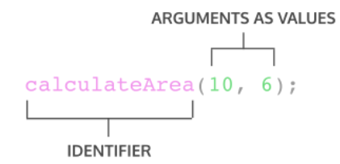
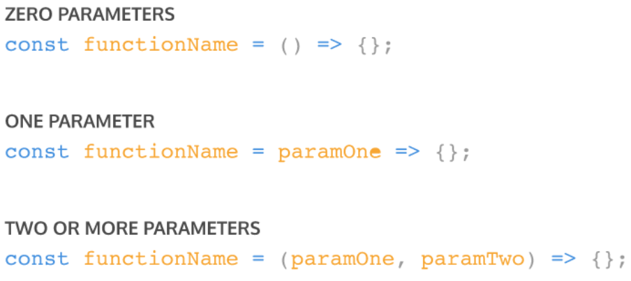
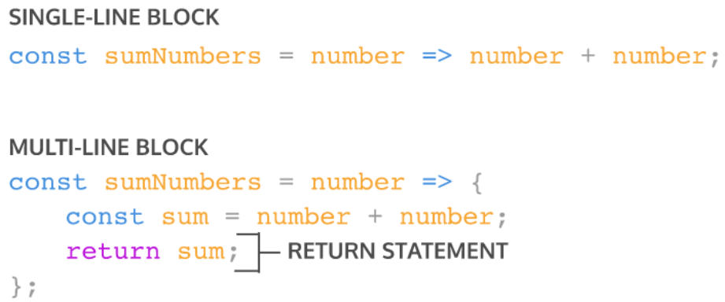

# **Writing and Presentation Week 2**

## **JavaScript Dasar - Scope and Function**

### **Scope**

Scope adalah konsep dalam flow data variabel. Menentukan suatu variabel bisa diakses pada scope tertentu atau tidak.

#### **Blocks**

Blocks adalah code yang berada didalam curly braces `{ }`. Conditional, function, dan looping menggunakan blocks.

```js
for (let i = 0; i < array.length; i++) {
	// Blocks
}
```

#### **Global Scope**

Global scope berarti variabel yang kita buat dapat diakses dimanapun dalam suatu file.

Agar menjadi Global Scope, suatu variabel harus dideklarasikan diluar Blocks.

```js
let myName = "Raisha";

function greeting() {
	return myName;
}

console.log(myName); // Raisha
```

#### **Local Scope**

Local scope berarti kita mendeklarasikan variabel didalam blocks seperti function, conditional, dan looping.

Maka variabel hanya bisa diakses didalam blocks saja. Tidak bisa diakses diluar blocks.

```js
function greeting() {
	let myName = "Raisha";
	return myName;
}
console.log(greeting()); // Raisha
console.log(myNane); // Error : myName is not defined
```

### **Function**

Function adalah sebuah blok kode dalam sebuah grup untuk menyelesaikan 1 task/1 fitur.

Saat kita membutuhkan fitur tersebut nantinya, kita bisa kembali menggunakannya.

`Contoh Function`

```js
function greeting() {
	return "Hello World";
}
```

<div align="center">
    
</div>

`Memanggil Function`

```js
greeting();
console.log(greeting());
```

<div align="center">
    
</div>

#### **Parameter Function**

Dengan parameter, function dapat menerima sebuah inputan data dan menggunakannya untuk melakukan task/tugas.

Saat membuat function/fitur, kita harus tahu data-data yang dibutuhkan. Misalnya saat membuat function penambahan 2 buah nilai. Data yang dibutuhkan adalah 2 buah nilai tersebut.

`Contoh Parameter Function`

```js
function calculateArea(width, height) {
	console.log(width * height);
}
```

<div align="center">
    
</div>

#### **Argumen Function**

Argumen adalah nilai yang digunakan saat memanggil function.

Jumlah argumen harus sama dengan jumlah parameternya

Jadi jika di function penambahan ada 2 parameter nilai saat membuat function. Saat memanggil function kita gunakan 2 buah nilai argumen.

```js
calculateArea(10, 20);
```

<div align="center">
    
</div>

#### **Default Parameters**

Default paramaters digunakan untuk memberikan nilai awal/default pada parameter function.

Default parameters bisa digunakan jika kita ingin menjaga function agar tidak error saat dipanggil tanpa argumen

```js
function greetOnWebsite(name = "Stranger") {
	return `Hello ${name}`;
}

console.log(greetOnWebsite("David")); // Hello David
console.log(greetOnWebsite()); // Hello Stranger
```

#### **Function Helper**

Kita bisa menggunakan function yang sudah dibuat pada function lain.

```js
function multiplyByNineFifths(number) {
	return number * (9 / 5);
}

function getFahrenheit(celcius) {
	return multiplyByNineFifths(celcius) + 32;
}

getFahrenheit(15); // return 59
```

#### **Arrow Function**

Arrow function adalah cara lain menuliskan function. Ini adalah fitur terbaru yang ada pada ES6 (Javascript Version)

```js
const greeting = () => {
	return `Hello World`;
};

const penambahan = (a, b) => {
	return a + b;
};
```

#### **Short Syntax Function**



Short Syntax Lainnya.



### **Penyelesaian Bug dan Error Pada JavaScript**

Error merupakan sebuah program yang gagal untuk berjalan, sedangkan bug merupakan kesalahan yang terdapat pada sebuah sistem yang menyebabkan program tidak berjalan secara normal. Lalu, untuk menyelesaikan error dapat menggunakan `try catch`

`Penggunaan Try Catch`

```js
function getData(param) {
	try {
		let data = dummyFunction(param);
		return data;
	} catch {
		console.log(error);
		return `Error With Message : ${error.message}`;
	}
}
```

`try` pada block tersebut digunakan untuk menjalankan sebuah program.

`catch` digunakan untuk mencari tahu atau mendapatkan sebuah error jika hal tersebut terjadi maka akan masuk ke block catch

## **JavaScript Dasar - DOM Manipulation**

Document Object Model atau biasa disebut DOM merupakan jembatan yang dapat menjadi penghubung antara dokumen HTML dan javascript. Dengan DOM kita dapat memanipulasi seluruh isi dokumen HTML. Fungsinya untuk memanipulasi tampilan web agar website lebih dinamis dan interaktif.

**Ada Beberapa Cara Untuk mendapatkan elemen HTML.**

```
1. document.getElementById(id) // mendapatkan element berdasarkan id. Akan mendapatkan 1 element spesifik
2. document.getElementsByTagName(name) // mendapatkan banyak element (collections) berdasarkan tag name
3. document.getElementsByClassName(name) // mendapatkan banyak element (collections) berdasarkan class name
4. document.querySelector(css selector) //mendapatkan satu element berdasarkan CSS selector
5. document.querySelectorAll(css selector) // mendapatkan banyak element (collections) berdasarkan CSS selector
6. parentElement // digunakan untuk menyeleksi parent dari suatu elemen
7. nextElementSibling // digunakan untuk menyeleksi elemen setelahnya dalam 1 parent
8. previousElementSibling // digunakan untuk menyeleksi elemen sebelumnya dalam 1 parent
```

`Contoh Mendapatkan Elemen HTML Dengan id`

`HTML`

```HTML
<html lang="en">
	<head>
		<title>Belajar DOM</title>
	</head>
	<body>
		<p id="textID">ini p dengan id</p>
	</body>
</html>
```

`JavaScript`

```js
let p = document.getElementById("textID");
console.log(p); // <p id="textID">ini p dengan id</p>
```

**Mengubah Konten HTML**

Selain mendapatkan elemen HTML, dengan DOM kita juga dapat mengubah konten HTML tersebut. Berikut ini beberapa cara untuk mengubah konten HTML.

```
1. Element.textContent
2. Element.innerHTML
```

`Contoh Mendapatkan Elemen HTML Dengan id`

```HTML
<html lang="en">
	<head>
		<title>Belajar DOM</title>
	</head>
	<body>
		<p id="textID"></p>
	</body>
</html>
```

`JavaScript`

```js
document.getElementById("textID").textContent = "p yang sekarang";
```

Maka yang muncul di Website adalah tulisan `p yang sekarang`

**Menangkap Interaksi User**

Bisa dilakukan dengan menggunakan `addEventListener(“event”)`

`Contoh`

```js
const button = document.getElementById("btn-submit");
button.addEventListener("click", () => {
	alert("Tombol di klik");
});
```
