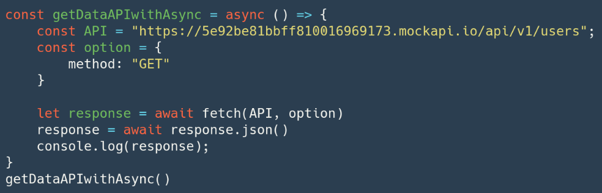

# **Writing and Presentation Week 3**

## **JavaScript Intermediate**

### **Array dan Multidimensional Array**

Array adalah tipe data list order yang dapat menyimpan tipe data apapun di dalamnya Array dapat menyimpan tipe data String, Number, Boolean, dan lainnya.

`Contoh Array`

```js
let array1 = ["Asep", "Bambang", "Cecep"];
let array2 = [true, 20, "string"];
```

`Mengambil Data Array`

```js
let array1 = ["Asep", "Bambang", "Cecep"];

console.log(array1[0]); // Asep
```

`Mengupdate Data Array`

```js
let array1 = ["Asep", "Bambang", "Cecep"];
array1[0] = "Adam";
console.log(array1); // ["Adam", "Bambang", "Cecep"]
```

#### **Array Properties**

Properties adalah fitur yang sudah disediakan oleh Javascript untuk memudahkan developer.

Contoh Array Properties `.length`

```js
let array1 = ["Asep", "Bambang", "Cecep"];
console.log(array1.length); // 3
```

#### **Array Method**

Array memiliki method atau biasa disebut built-in methods. Artinya Javascript sudah memudahkan kita dengan menyediakan function/method umum yang bisa kita gunakan.

`Beberapa Contoh Method yang tersedia`

```js
const value = ["Rusa", "Badak", "Kelinci", "Paus", "Kijang", "Buaya"];

value.push("Panda"); //menambahkan value di akhir
value.pop(); //menghapus data Array yang terakhir
value.unshift("Kerang"); //menambah value di awal
value.shift(); //menghapus data Array yang pertama

//method yang penting pada penerapan proyek nyata
value.forEach((e) => {
	console.log(e);
}); //perulangan untuk mendapatkan data Array

value.map((e) => {
	console.log(e);
}); //perulangan untuk mendapatkan data Array

let Badak = value.filter((e) => {
	return e == "Badak";
}); //Untuk mendapatkan data yang bernama Badak
```

### **Object**

Object adalah sebuah tipe data pada variabel yang menyimpan properti dan fungsi (method)

Properti adalah data lengkap dari sebuah object.

Method adalah action dari sebuah object. Apa saja yang dapat dilakukan dari suatu object.

`Contoh Object`

```js
let object = {
	nama: "Udin",
	umur: 29,
	hobi: "tidur",
};
```

`Beberapa Cara Mengakses Object`

```js
let data = {
	id: 0,
	nama: "Udin Pratama",
	umur: 29,
	sayHello: () => {
		console.log("Hello");
	},
};

console.log(data.nama); //mendapatkan data nama dengan dot natation
console.log(data.sayHello()); //mendapatkan method sayHello dengan pesan "Hello"

data.nama = "Bambang Sulis"; //mengganti property nama dari "Udin Pratama" menjadi "Bambang Sulis"

data.hobi = "tidur"; // menambah data hobi

delete data.umur; //menghapus property umur
```

#### **Array of Objects**

Merupakan Object atau sekumpulan Object yang ada di dalam Array. Array of object biasanya di dapatkan saat mengerjakan sebuah proyek dengan menggunakan JSON.

Perbedaan dari Array sebelumnya, Array sebelumnya menyimpan data primiif tanpa objek, sedangkan Array of Object akan menyimpan data di dalam Object.

`Contoh`

```js
let data = [
	{
		id: 1,
		username: "Asep",
	},
	{
		id: 2,
		username: "Udin",
	},
	{
		id: 3,
		username: "Bambang",
	},
];

//cara akses manual
console.log(data[0].nama); // Asep

//cara akses dengan looping
data.map((value) => {
	return value.id + ". " + value.nama;
});
```

### **Rekursif**

Recursive adalah function yang memanggil dirinya sendiri sampai kondisi tertentu.

Recursive kebanyakan digunakan untuk case matematika, fisika, kimia, dan yang berhubungan dengan calculation.

`Contoh Penggunaan Rekursif`

Menghitung Faktorial

```js
function pangkatRekursif(x, n) {
	if (n == 0) {
		return 1;
	} else if (n > 0) {
		return x * pangkatRekursif(x, n - 1);
	} else if (n < 0) {
		return 1 / pangkatRekursif(x, -n);
	}
}

console.log(pangkatRekursif(2, 4)); // 2^4 = 16
```

### **JavaScript Asynchronous**

Javascript adalah bahasa pemrograman single-thread yang artinya hanya dapat mengeksekusi satu task pada satu waktu atau biasa disebut synchronous.

Sedangkan Asynchronous mengizinkan komputer memproses task yang lain sambil menunggu proses yang masih berlangsung.

Kita bisa membuat asynchronous secara simulasi artinya tidak murni asynchronous dengan beberapa cara:

1. Callback
2. Promises
3. Async/Await

#### **Callback**

Callback function adalah function yang kita letakan di dalam argumen/parameter pada function, dan function tersebut akan dieksekusi setelah function pertama menyelesaikan tugasnya.

`Contoh Callback`

```js
const main = (number1, number2, callback) => {
	console.log(number1 + number2);
	callback();
};
const myCallback = () => {
	console.log("Donee !");
};

main(1, 2, myCallback); // Output : 3 Donee !
```

#### **Promise**

Promise adalah salah satu fitur baru di ES6, biasa digunakan untuk melakukan http request/fetch data dari API.

`Contoh Promise`

```js
const contohPromise = () => {
	new Promise((resolve, reject) => {
		if (true) {
			resolve("Req Sukses");
		} else {
			reject(new Error("Something Wrong!"));
		}
	})
		.then((res) => console.log(result))
		.catch((err) => console.log(err));
};

contohPromise();
```

#### **Async Await**

Async - await adalah salah satu fitur baru dari javascript yang digunakan untuk menangani hasil dari sebuah Promise.

Sedangkan await berfungsi untuk menunda sebuah kode dijalankan sampai proses asynchronous berhasil.

`Contoh Async Await`

```js
const hello = async () => {
	let res = await "Hello";
	return res;
};
```

#### **HTTP Request fetch()**

Fetch adalah native web API untuk melakukan HTTP calls dari external network.

fetch() memiliki parameter utama yaitu URL/endpoint API, dan parameter kedua yaitu options, options ini berisi method, headers dan body. Tergantung keinginan kita.

`Contoh Mengambil Data API Dengan FETCH`

<div align="center">
    
</div>
