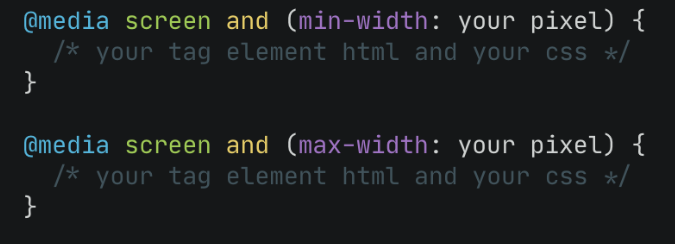
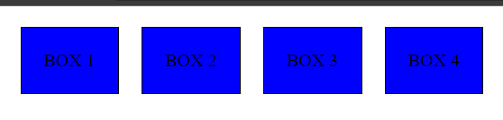
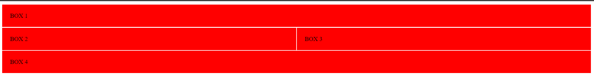
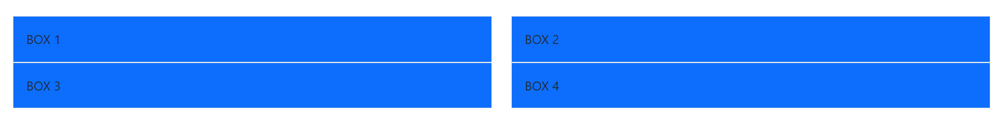

# **Writing and Presentation Week 4**

## **GIT & Github Lanjutan**

### **GIT**

Git merupakan sebuah tools sebagai Version Control System yang berarti untuk mencatat setiap perubahan file pada suatu proyek yang dikerjakan sejara individu atau berkelompok.

### **GITHUB**

GitHub merupakan sebuah cloud base yang digunakan untuk mengupload atau mengelola sebuah file.

Git dan Github adalah tools yang wajib digunakan oleh programmer khususnya saat sedang berkolaborasi dengan tim. Karena dengan Git dan Github mempermudah programmer dalam menyimpan file project bersama dan dapat melacak setiap perubahan yang terjadi pada file-file tersebut. Selain itu juga tidak perlu menunggu rekan dalam satu tim menyelesaikan suatu task dahulu untuk berkolaborasi, sehingga mempercepat menyelesaikan sebuah project dalam tim.

### **Alur Kerja Menggunakan Git & Github**

1. Install GIT

    - Cek Apabila GIT Sukses Terinstall dengan perintah
        ```bash
        git --version
        ```

2. Setup Awal `username` dan `email` GIT Menggunakan perintah `git config`

    Contoh.

    ```bash
    git config --global user.name "zekais"
    git config --global user.email "zekais@gmail.com"
    ```

    Apabila Ingin Cek Setup github dengan perintah

    ```bash
    git config --list
    ```

3. Membuat Repositori Github, Bisa Langsung Melalui Website github.com

    

4. Membuat Folder Kosong di local, kemudian melakukan init dengan perintah

    ```bash
    git init .
    ```

5. Untuk Menghubungkan Folder Local dengan Repositori yang ada di Github bisa melakukan Remote, dengan perintah.

    ```bash
    git remote add origin <url repo github.git>
    ```

    Setup Branch ke `MAIN` dengan perintah

    ```bash
    git branch -M main
    ```

6. Selanjutnya Menambahkan File atau Folder baru di local, bisa dengan perintah `mkdir` atau `touch`
7. Untuk mengupload ke github kembali dengan perintah.
    ```bash
    git add .
    ```
8. Setelah itu Jika dirasa semua sudah sesuai bisa melakukan commit dengan perintah.
    ```bash
    git commit -am "Ini Pesan Commit"
    ```
9. Agar terpublish di Github melalui perintah.
    ```bash
    git push origin main
    ```

### **Clone Repo Github**

Untuk Melakukan kloning repository public github bisa menggunakan perintah `git clone [repo github]`

`Example Clone Repo https://github.com/fawwaz37/whatsapp-gateway`

```shell
git clone https://github.com/fawwaz37/whatsapp-gateway.git
```

### **Langkah-langkah kolaborasi**

1. masing-masing anggota lakukan `git clone` pada repo yg sudah dibuat (1x aja)
2. Bagi tugas pada masing-masing anggota kelompok
3. pindah ke branch dev `git switch dev`
4. sebelum ngoding, lakukan `git pull` pada branch dev untuk update kode terbaru
5. Anggota membuat branch dari dev `git branch [nama-branch] `
6. Pindah ke dalam branch yg sudah dibuat `git switch [nama-branch]`
7. lakukan pengerjaan di dlm branch tersebut
8. jika fitur sudah selesai, sebelum di push lakukan langkah no 3, 4, dan 6
9. Lalu `git merge dev` untuk menhindari conflict di github
10. Jika ada conflict, bereskan semuanya
11. jika sudah aman, commit lalu `git push origin [nama-branch]`
12. lakukan pull request untuk merge ke branch dev
13. tunggu pull request di acc oleh team lead
14. jika sudah, ulangi proses dari no 2

Note: langkah no 8 dan 9 dapat di ganti dgn `git pull origin dev`

### **Menyelesaikan & Menghindari Konflik Pada Github**

Untuk Menyelesaikan & Menghindari konflik yang terjadi pada saat menggabungkan kode pada github adalah sebagai berikut.

1. Periksa baris kode dan file yang sedang terjadi konflik
2. Segera lakukan konfirmasi kepada para anggota yang berkolaborasi
3. Anggota yang mengalami konflik harus melakukan pull `git pull`
4. Lakukan merge untuk melihat konfliknya `git merge`
5. Lakukan diskusi dengan kelompok untuk menentukan code mana yang akan dipakai
6. Lalu lakukan proses stagged sampai commit, dan push file ke repository

## **Responsive Web Design**

### **Apa itu Responsive Web Design**

Responsive web design merupakan desain website yang dapat diakses di device manapun seperti mobile, desktop, dan tablet. Jadi, design di dalam website akan memposisikan dirinya sesuai dengan device yang dipakai.

<div align="center">
    
</div>

### **Tools untuk website responsive**

Pada Browser Chrome biasa disebut dengan Dev Tools. Adapun Cara Mengakses Dev Tools ini bisa menggunakan Shortcut berikut ini.

`ctrl` + `shift` + `j`

### **Menggunakan Viewport**

```html
<meta name="viewport" content="width=device-width, initial-scale=1.0" />
```

### **CSS Relative Units**

CSS unit adalah satuan untuk menentukan ukuran dari suatu elemen atau kontennya. Misal, jika ingin menentukan margin dari sebuah paragraf, kita bisa memberikan nilai tertentu. Nilai ini akan diikuti oleh satuan (CSS unit).

Dalam CSS ada yang namanya absolut units dan relative units, keduanya berbeda secara sifatnya. Absolut akan selalu tetap dalam ukuran layar apapun, sedangkan relative akan menyesuaikan.

Contoh Relative Units pada CSS

-   %: Ukurannya relatif terhadap parent element
-   em: Ukurannya relatif terhadap font-size dari elemen saat ini
-   rem: Ukurannya relatif terhadap font-size root elemen (). "rem" = "root em"
-   ch: Ukurannya mengikuti jumlah karakter (1 karakter sama dengan lebar dari karakter 0/nol font yang sedang aktif)
-   vh: Ukurannya relatif terhadap tinggi viewport (ukuran jendela tau aplikasi), 1vh = 1/100 dari tinggi viewport
-   vw: Ukurannya relatif terhadap lebar dari viewport. 1vw = 1/100 lebar viewport
-   vmin: Ukurannya relatif terhadap ukuran viewport yang lebih kecil (misalnya diorientasi portrait, lebar akan lebih kecil daripada tinggi). 1vmin = 1/100 dari ukuran viewport yang lebih kecil.
-   vmax: Sama dengan vmin, dia akan melihat ukuran viewport yang lebih besar
-   ex: Ukurannya relatif terhadap tinggi dari karakter "x" kecil font yang sedang aktif.

### **Media Query**

Media Query digunakan untuk membuat beberapa styles tergantung pada jenis device

`Penggunaan Media Query`



#### **Flexbox & Grid**

Flexbox dan Grids sama-sama berfungsi untuk mengatur tampilan sebuah halaman web menjadi lebih terstruktur dan rapi. Perbedaannya hanya terletak pada arah pembagian dimensinya saja.

Flexbox hanya dapat mengatur arah pembagian dimensi tampilan hanya secara horizontal saja atau secara vertikal saja.

Sebagai contoh, pada flexbox, jika kita atur arahnya menjadi "kolom", maka tampilannya hanya terbagi rata secara vertikal. Begitu juga dengan arah "baris" yang akan secara horizontal.

##### **Implementasi Flexbox**

```html
<!DOCTYPE html>
<html lang="en">
	<head>
		<meta charset="UTF-8" />
		<meta http-equiv="X-UA-Compatible" content="IE=edge" />
		<meta name="viewport" content="width=device-width, initial-scale=1.0" />
		<link rel="stylesheet" href="styles.css" />
		<title>Responsive Web Design</title>

		<style>
			#flex {
				display: flex;
			}

			#flex div {
				background-color: blue;
				padding: 20px;
				margin: 10px;
				border: 1px;
				border-color: black;
				border-style: solid;
			}
		</style>
	</head>

	<body>
		<div id="flex">
			<div>BOX 1</div>
			<div>BOX 2</div>
			<div>BOX 3</div>
			<div>BOX 4</div>
		</div>
	</body>
</html>
```

`Hasil`

<div align="center">
    
</div>

##### **Implementasi Grid**

```html
<!DOCTYPE html>
<html lang="en">
	<head>
		<meta charset="UTF-8" />
		<meta http-equiv="X-UA-Compatible" content="IE=edge" />
		<meta name="viewport" content="width=device-width, initial-scale=1.0" />
		<link rel="stylesheet" href="styles.css" />
		<title>Responsive Web Design</title>

		<style>
			#grid {
				display: grid;
				grid-template-areas:
					"header header header header"
					"left left right right"
					"footer footer footer footer";
			}
			#grid div {
				background-color: red;
				padding: 20px;
				margin: 1px;
				border: 2px;
			}
			.box-1 {
				grid-area: header;
			}
			.box-2 {
				grid-area: left;
			}
			.box-3 {
				grid-area: right;
			}
			.box-4 {
				grid-area: footer;
			}
		</style>
	</head>

	<body>
		<div id="grid">
			<div class="box-1">BOX 1</div>
			<div class="box-2">BOX 2</div>
			<div class="box-3">BOX 3</div>
			<div class="box-4">BOX 4</div>
		</div>
	</body>
</html>
```

`Hasil`

<div align="center">
    
</div>

## **Bootstrap**

Bootstrap adalah sebuah framework yang paling populer digunakan untuk membuat sebuah website. Bootstrap membuat front-end developer dapat membuat website dengan cepat, fokus pada responsive mobile, dan membuat website menjadi lebih interaktif tanpa membuat banyak CSS dan JavaScript dari nol.

`Cara Menambahkan Bootstrap Pada HTML`

```html
<link href="https://cdn.jsdelivr.net/npm/bootstrap@5.0.2/dist/css/bootstrap.min.css" rel="stylesheet" integrity="sha384-EVSTQN3/azprG1Anm3QDgpJLIm9Nao0Yz1ztcQTwFspd3yD65VohhpuuCOmLASjC" crossorigin="anonymous" />
```

#### **Layout Pada Bootstrap**

Layout dalam bootstrap menggunakan row dan col seperti grid pada css, dan class container sebagai penampung utamanya. Berikut ini implementasinya.

```html
<!DOCTYPE html>
<html lang="en">
	<head>
		<meta charset="UTF-8" />
		<meta http-equiv="X-UA-Compatible" content="IE=edge" />
		<meta name="viewport" content="width=device-width, initial-scale=1.0" />
		<link rel="stylesheet" href="styles.css" />
		<link href="https://cdn.jsdelivr.net/npm/bootstrap@5.0.2/dist/css/bootstrap.min.css" rel="stylesheet" integrity="sha384-EVSTQN3/azprG1Anm3QDgpJLIm9Nao0Yz1ztcQTwFspd3yD65VohhpuuCOmLASjC" crossorigin="anonymous" />
		<title>Responsive Web Design</title>
	</head>

	<body>
		<div class="container p-5">
			<div class="row gy-6">
				<div class="col-6">
					<div class="p-3 border bg-primary">BOX 1</div>
				</div>
				<div class="col-6">
					<div class="p-3 border bg-primary">BOX 2</div>
				</div>
				<div class="col-6">
					<div class="p-3 border bg-primary">BOX 3</div>
				</div>
				<div class="col-6">
					<div class="p-3 border bg-primary">BOX 4</div>
				</div>
			</div>
		</div>
	</body>
</html>
```

`Hasil`

<div align="center">
    
</div>

#### **Component pada Bootstrap**

Ada banyak sekali component-component pada bootstrap yang memudahkan dan mempercepat development pada suatu web, contoh component bootstraps :

-   Alert
-   Carousel
-   Card
-   Button
-   Modal
-   Dan lainnya di [Bootstrap](https://getbootstrap.com/docs/5.2/components)

#### **Membuat Website Responsive dengan Bootstrap**

Berikut ini hasil Website yang saya buat menggunakan Bootstrap https://movie-zekais.netlify.app/
