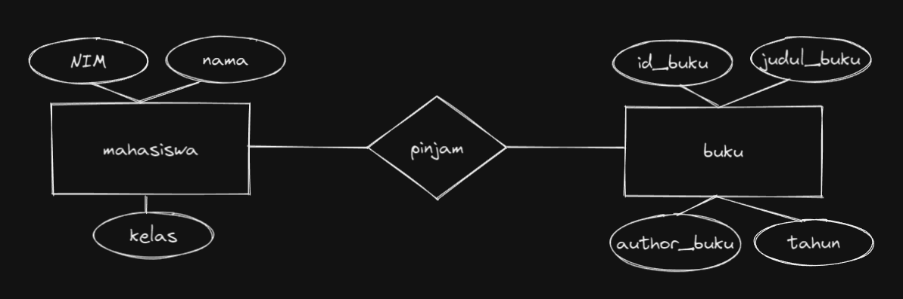
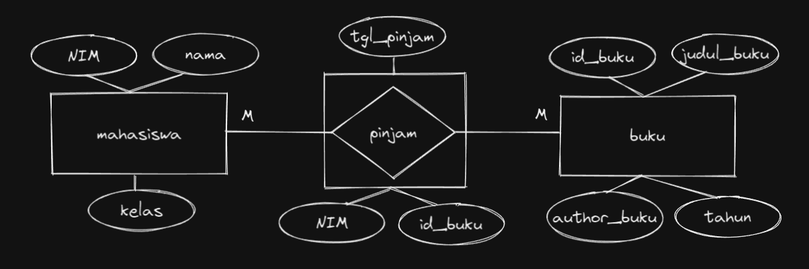

# **Writing and Presentation Week 5**

## **BACKEND STAGE**

### **Web Server & RESTful API**

**`Konsep Web Server`**

<div style="  text-align: justify; text-justify: inter-word;">Web server adalah software yang memberikan layanan data yang mempunyai fungsi untuk menerima permintaan HTTP (HyperText Transfer Protocol) atau HTTPS yang dikirim oleh klien melalui web browser dan mengirimkan kembali hasilnya dalam bentuk halaman web yang umumnya berbentuk dokumen HTML (HyperText Markup Language). Web server berguna sebagai tempat aplikasi web dan sebagai penerima request dari client</div><br />

**`Konsep RESTful API`**

<div style="  text-align: justify; text-justify: inter-word;">RESTful API / REST API merupakan penerapan dari API (Application Programming Interface). Sedangkan REST (Representional State Transfer) adalah sebuah arsitektur metode komunikasi yang menggunakan protokol HTTP untuk pertukaran data dimana metode ini sering diterapkan dalam pengembangan aplikasi. Dengan tujuannya untuk menjadikan sistem memiliki performa yang baik, cepat dan mudah untuk di kembangkan (scale) terutama dalam pertukaran dan komunikasi data.</div><br />

RESTFUL API memiliki 4 komponen penting yaitu :

1. **URL Design** ( URL API biasa disebut endpoint dalam pemanggilannya. )
2. **HTTP Verbs** ( Setiap request yang dilakukan terdapat metode yang dipakai agar server mengerti apa yang sedang di request client: GET, POST, PUT, DELETE )
3. **HTTP Response Code** ( HTTP Response Code adalah kode standarisasi dalam menginformasikan hasil request kepada client )
4. **Format Response** ( Setiap request yang dilakukan client akan menerima data response dari server, response tersebut biasanya berupa data XML ataupun JSON )
   <br />

### **NODE JS**

**`Konsep Node JS`**

<div style="  text-align: justify; text-justify: inter-word;">Node.js adalah runtime environment untuk JavaScript yang bersifat open-source dan cross-platform. Dengan Node.js kita dapat menjalankan kode JavaScript di mana pun, tidak hanya terbatas pada lingkungan browser. Node.js menjalankan V8 JavaScript engine (yang juga merupakan inti dari Google Chrome) di luar browser. Ini memungkinkan Node.js memiliki performa yang tinggi. Node.js juga menyediakan banyak library/module JavaScript yang membantu menyederhanakan pengembangan aplikasi web.</div><br />

-   **Node JS Untuk Backend**

    Berikut Ini Module Populer Untuk Pengembangan Backend pada Node JS.

    1.  **Console**
        Digunakan sebagai debug atau menampilkan code secara interface

        ```js
        console.log("Hello World");
        ```

    2.  **Process**
        Menampilkan dan mengontrol prosess Node JS yang sedang dijalankan

        ```js
        const { PORT } = process.env;
        console.log(PORT);
        ```

    3.  **OS**
        Menyediakan informasi terkait sistem operasi komputer yang digunakan user

        ```js
        const os = require("os");
        console.log(`Platform : ${os.platform()}`);
        console.log(`Architecture : ${os.arch()}`);
        ```

    4.  **Util**
        Alat bantu / utilities untuk mendukung kebutuhan internal API di Node JS

        ```js
        const util = require("util");
        const debuglog = util.debuglog("foo");
        debuglog(`Hello from foo [%d]`, 123);
        ```

    5.  **Errors**
        Digunakan untuk mendefinisikan error di Node JS sehingga lebih informatif. Kita juga dapat menghandle error menggunakan try catch

        ```js
        try {
        	// Code
        } catch (err) {
        	console.log(err);
        }
        ```

        dll

-   **Membuat Web Server Dengan Node JS**
    Membuat Server Node JS dengan Menggunakan http

    ```js
    const http = require("http");

    const hostname = "127.0.0.1";
    const port = 3000;

    const server = http.createServer((req, res) => {
    	res.statusCode = 200;
    	res.setHeader("Content-Type", "text/plain");
    	res.end("Hello World");
    });

    server.listen(port, hostname, () => {
    	console.log(`Server running at http://${hostname}:${port}/`);
    });
    ```

### **EXPRESS JS**

**`Konsep Express JS`**

<div style="  text-align: justify; text-justify: inter-word;">Express.js adalah framework web app untuk Node.js yang ditulis dengan bahasa pemrograman JavaScript.Express.js adalah framework back end. Artinya, express js bertanggung jawab untuk mengatur fungsionalitas website, seperti pengelolaan routing dan session, permintaan HTTP, penanganan error, serta pertukaran data di server. </div><br />

**`Basic Syntax Express JS`**

```js
const express = require("express");
const app = express();
const port = 3000;

app.get("/", (req, res) => {
	res.send("Hello World!");
});

app.listen(port, () => {
	console.log(`Example app listening on port ${port}`);
});
```

-   **Router Pada Express JS**

    <br /><div style="  text-align: justify; text-justify: inter-word;">Router adalah sebuah end point setelah mengakses sebuah URL pada suatu website. Pada Router Ini juga bisa menggunakan Method HTTP sepert GET, POST, PUT, DELETE</div><br />

    **`Contoh Routing Pada Express JS`**

    ```js
    app.get("/", (req, res) => {
    	res.send("Ini Method GET");
    });

    app.post("/", (req, res) => {
    	res.send("Ini Method POST");
    });

    app.put("/", (req, res) => {
    	res.send("Ini Method PUT");
    });

    app.delete("/", (req, res) => {
    	res.send("Ini Method DELETE");
    });
    ```

-   **Middleware Pada Express JS**

    <br /><div style="  text-align: justify; text-justify: inter-word;">Middleware adalah sebuah fungsi yang dapat mengakses request dan response. Middleware merupakan penengah, kalau di dalam aplikasi middleware adalah sebuah aturan yang harus dilewati oleh sistem terlebih dahulu untuk masuk atau keluar dari sistem.</div><br />

    **`Contoh Middleware Pada Express JS`**

    ```js
    const logger = (req, res, next) => {
    	console.log(`Ini Logger Request Acc`);
    	next();
    };

    app.use(logger);
    ```

### **Design Database With MySQL**

Design Database dengan studi kasus mahasiswa meminjam buku<br />

-   **Membuat Entity Diagram**

    

    <br />Pada gambar terdapat 2 Entitas Yakni Mahasiswa dan buku dengan konjungsi pinjam<br />

-   **Membuat Entity Atribut**

    

    <br />Pada gambar diatas masing masing entitas memiliki atribut. Sperti pada Entitas mahasiswa memiliki atribut, NIM, nama, dan kelas. Sedangkan Pada Entitas buku memiliki atribut id_buku, judul_buku, author_buku, dan tahun<br />

-   **Membuat Relasi Entity**

    

    <br />Pada gambar diatas telah terbentuk relasi many to many<br />
