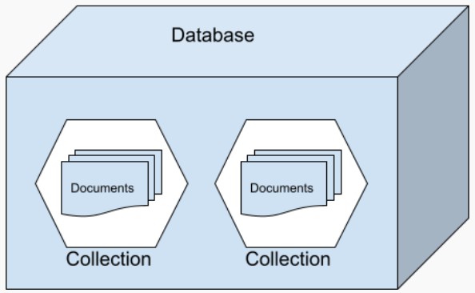
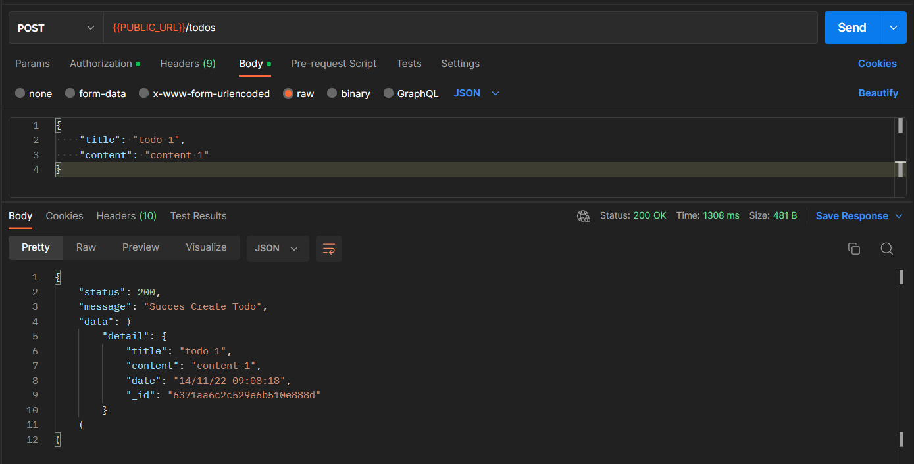

# **Writing and Presentation Week 7**

## **BACKEND STAGE**

### **Sequelize**

**1. Memahami dan Menggunakan Sequalize**

<div style="  text-align: justify; text-justify: inter-word;">Sequelize adalah Node.js promise-based ORM untuk MySQL, PostgreSQL, SQLite, MSSQL dan database SQL lainnya. Sequelize berfungsi untuk bekerja dengan database dan relasi-relasi di dalamnya.</div><br />

<div style="  text-align: justify; text-justify: inter-word;">Sedangkan ORM adalah suatu metode/teknik pemrograman yang digunakan untuk mengkonversi data dari lingkungan bahasa pemrograman berorientasi objek (OOP) dengan lingkungan database relational.  </div><br />

**Install Sequelize**

-   **Install sequelize-cli global**
    ```sh
    npm install -g sequelize-cli
    ```
    <br />
-   **Install sequelize NPM**
    ```sh
    npm install sequelize
    ```
    <br />
-   **Install Driver Mysql**
    ```sh
    npm install mysql2
    ```
    <br />

**Generate Sequelize**

-   **Sequelize Init**

    ```sh
    npx sequelize-cli init
    ```

    <br />

-   **Config Database**

    ```js
    const Sequelize = require("sequelize");
    const sequelize = new Sequelize("database", "username", "password", {
    	host: "localhost",
    	dialect: "mysql",
    });
    ```

    <br />

-   **Generate Model**
    ```sh
    npx sequelize-cli model:generate --name Todo -- attributes title:string, description:string, startTime:date, status:string
    ```
    <br />

**2. Membuat API Specification**

<div style="  text-align: justify; text-justify: inter-word;">Membuat TODO App Sederhana dengan sequelize mysql </div><br />

|   Fitur Todo    |     EndPoint      | Method |
| :-------------: | :---------------: | :----: |
|   Create Todo   |      /todos/      |  POST  |
| Get Detail Todo | /todos/:\_id-todo |  GET   |
|   Update Todo   | /todos/:\_id-todo |  PUT   |
| Delete One Todo | /todos/:\_id-todo | DELETE |

**3. Membuat Web Server dan RESTFul API**

-   **Setup File + Install Express**

    ```sh
    npm init --y
    npm i express
    ```

    `File app.js`

    ```js
    import express from "express";
    import todoRoute from "./router/todo.router.js";

    const app = express();
    const port = 3000;
    app.use(express.json());

    app.get("/", (req, res) => {
    	res.send("API Aktif!");
    });

    app.use("/todos", todoRoute);

    app.listen(port, () => {
    	console.log(`App listening on port ${port}`);
    });
    ```

-   **Create Todo**

    ```js
    import Todo from "./database/todo.model.js";

    router.post("/", async (req, res) => {
    	try {
    		const { title, description, startTime, status } = req.body;
    		const newTodo = await Todo.create({ title, description, startTime, status });
    		req.status(200).send({
    			status: res.statusCode,
    			message: "Todo Sukses Dibuat",
    			data: newTodo,
    		});
    	} catch (error) {
    		res.status(500).send({
    			status: res.statusCode,
    			message: `Internal Server Error!`,
    		});
    	}
    });
    ```

-   **Get Todo**

    ```js
    router.get("/:id", async (req, res) => {
    	try {
    		const { id } = req.params;
    		const todo = await Todo.findOne({ id });
    		req.status(200).send({
    			status: res.statusCode,
    			message: "GET Todo!",
    			data: todo,
    		});
    	} catch (error) {
    		res.status(500).send({
    			status: res.statusCode,
    			message: `Internal Server Error!`,
    		});
    	}
    });
    ```

-   **Update Todo**

    ```js
    router.put("/:id", async (req, res) => {
    	try {
    		const { id } = req.params;
    		const { title, description, startTime, status } = req.body;
    		const todo = await Todo.update(
    			{ title, description, startTime, status },
    			{
    				where: { id },
    			}
    		);
    		req.status(200).send({
    			status: res.statusCode,
    			message: `Update Todo ID : ${id}!`,
    			data: todo,
    		});
    	} catch (error) {
    		res.status(500).send({
    			status: res.statusCode,
    			message: `Internal Server Error!`,
    		});
    	}
    });
    ```

-   **Delete Todo**

    ```js
    router.delete("/:id", async (req, res) => {
    	try {
    		const { id } = req.params;
    		const db = await Todo.findOne({ where: { id } });
    		await db.destroy();
    		req.status(200).send({
    			status: res.statusCode,
    			message: `Delete Todo ID : ${id}!`,
    		});
    	} catch (error) {
    		res.status(500).send({
    			status: res.statusCode,
    			message: `Internal Server Error!`,
    		});
    	}
    });
    ```

### **Mongo DB**

**1. Memahami Basic dari MongoDB**

<div style="  text-align: justify; text-justify: inter-word;">MongoDB adalah salah satu jenis database NoSQL yang cukup populer digunakan dalam sebuah website. Jika database jenis SQL lain menyimpan data menggunakan relasi tabel, maka perbedaannya dengan MongoDB adalah di mana berbasis dokumen yang menggunakan format file berupa JSON (JavaScript Object Notation).</div><br />

**Komponen MongoDB**



-   Database adalah wadah untuk menyimpan berbagai macam Collection.
-   Collection adalah kumpulan dari berbagai document, collection sering disamakan dengan tabel pada SQL.
-   Document adalah unit terkecil yang berada pada MongoDB

**2. Melakukan Operasi CRUD pada MongoDB**

-   **Create Collection**

    ```mongodb
    db.createCollection("todo")
    ```

-   **Insert Data**

    ```mongodb
    db.todo.insert({title: "todo 1", content: "content 1"})
    ```

-   **Get Data**

    ```mongodb
    db.todo.find()
    ```

-   **Update Data**

    ```mongodb
    db.todo.update({ _id: "xxx" }, {title: "todo 1 update"})
    ```

-   **Delete Data**

    ```mongodb
    db.todo.remove({_id: "xxx"})
    ```

**3. Memahami dan Membuat Skema Serta Relasi pada MongoDB**

-   **One To One**
    Contoh Data One To One Pada MongoDB

    ```json
    {
    	"_id": "ObjectId('aa')",
    	"email": "asep@gmail.com",
    	"password": "tes123"
    }
    ```

-   **One To Many**
    Contoh Data One To Many Pada MongoDB menggunakan Reference.

    `user`

    ```json
    {
    	"_id": "ObjectId('aa')",
    	"email": "asep@gmail.com",
    	"password": "tes123",
    	"todo": ["ObjectID('xx')", "ObjectID('yy')"]
    }
    ```

    `todo`

    ```json
    [
    	{
    		"_id": "ObjectId('xx')",
    		"title": "todo 1",
    		"content": "content 1"
    	},
    	{
    		"_id": "ObjectId('yy')",
    		"title": "todo 2",
    		"content": "content 2"
    	}
    ]
    ```

### **Mongoose**

<div style="  text-align: justify; text-justify: inter-word;">Mongoose adalah sebuah module pada NodeJS yang di install menggunakan npm, berfungsi sebagai penghubung antara NodeJS dan database nosql MongoDB.</div><br />

<div style="  text-align: justify; text-justify: inter-word;">Mongoose menyediakan feature diantaranya, model data application berbasis Schema. Dan juga termasuk built-in type casting, validation, query building, business logic hooks dan masih banyak lagi yang menjadi ke andalan mongoose.</div><br />

**1. Membuat API Specification**

<div style="  text-align: justify; text-justify: inter-word;">Membuat TODO App Sederhana dengan mongoose </div><br />

|   Fitur Todo    |     EndPoint      | Method |
| :-------------: | :---------------: | :----: |
|   Create Todo   |      /todos/      |  POST  |
| Get Detail Todo | /todos/:\_id-todo |  GET   |
|   Update Todo   | /todos/:\_id-todo |  PUT   |
| Delete One Todo | /todos/:\_id-todo | DELETE |

**2. Membuat Web Server dan RESTFul API menggunakan Mongoose**

-   **Setup File + Install Express**

    ```sh
    npm init --y
    npm i express
    ```

    `File app.js`

    ```js
    import express from "express";
    import todoRoute from "./router/todo.router.js";

    const app = express();
    const port = 3000;
    app.use(express.json());

    app.get("/", (req, res) => {
    	res.send("API Aktif!");
    });

    app.use("/todos", todoRoute);

    app.listen(port, () => {
    	console.log(`App listening on port ${port}`);
    });
    ```

-   **Create Todo**

    ```js
    import Todo from "./database/todo.model.js";

    router.post("/", async (req, res) => {
    	try {
    		const { title, content } = req.body;
    		const newTodo = await Todo.create({ title, content });
    		req.status(200).send({
    			status: res.statusCode,
    			message: "Todo Sukses Dibuat",
    			data: newTodo,
    		});
    	} catch (error) {
    		res.status(500).send({
    			status: res.statusCode,
    			message: `Internal Server Error!`,
    		});
    	}
    });
    ```

-   **Get Todo**

    ```js
    router.get("/:id", async (req, res) => {
    	try {
    		const { id } = req.params;
    		const todo = await Todo.findOne({ _id });
    		req.status(200).send({
    			status: res.statusCode,
    			message: "GET Todo!",
    			data: todo,
    		});
    	} catch (error) {
    		res.status(500).send({
    			status: res.statusCode,
    			message: `Internal Server Error!`,
    		});
    	}
    });
    ```

-   **Update Todo**

    ```js
    router.put("/:id", async (req, res) => {
    	try {
    		const { id } = req.params;
    		const { title, content } = req.body;
    		const todo = await Todo.updateOne({ _id }, { title, content });
    		req.status(200).send({
    			status: res.statusCode,
    			message: `Update Todo ID : ${id}!`,
    			data: todo,
    		});
    	} catch (error) {
    		res.status(500).send({
    			status: res.statusCode,
    			message: `Internal Server Error!`,
    		});
    	}
    });
    ```

-   **Delete Todo**

    ```js
    router.delete("/:id", async (req, res) => {
    	try {
    		const { id } = req.params;
    		const db = await Todo.deleteOne({ id });
    		req.status(200).send({
    			status: res.statusCode,
    			message: `Delete Todo ID : ${id}!`,
    		});
    	} catch (error) {
    		res.status(500).send({
    			status: res.statusCode,
    			message: `Internal Server Error!`,
    		});
    	}
    });
    ```

### **Docker**

**1. Memahami container pada Docker**

-   Docker adalah software yang menjalankan suatu aplikasi menggunakan container.
-   Docker men-sharing kernel dari host OS, serta meng-container-kan suatu aplikasi agar dapat dijalankan dimana saja dan kapan saja.
-   Container digunakan untuk menyatukan berbagai macam file yang dibutuhkan oleh perangkat lunak yang agar aplikasi dapat digunakan dimana saja.

**2. Memahami dan Menggunakan Basic dari Docker**

-   **Download Image dari Docker Hub**

    ```sh
    docker pull
    ```

-   **Melihat Kumpulan Images yang Sudah Terdownload**

    ```sh
    docker images
    ```

-   **Menjalankan Container**

    ```sh
    docker run
    ```

-   **Melihat Container yang Berjalan**

    ```sh
    docker ps
    ```

### **Postman**

**1. Memahami manfaat Postman**

<div style="  text-align: justify; text-justify: inter-word;">Postman adalah sebuah aplikasi yang berfungsi sebagai REST Client untuk uji coba REST API. Postman biasa digunakan oleh developer pembuat API sebagai tools untuk testing API yang telah mereka buat. Adapun manfaat menggunakan postman secara gratis adalah dapat Sharing Collection API Documentation dan Testing API</div><br />

**2. Melakukan Testing API dengan Postman**



<div style="  text-align: justify; text-justify: inter-word;">Pada Gambar Diatas saya melakukan testing API menggunakan Method POST dan menginputkan body. Setelah klik send maka akan muncul tampilan response</div><br />

**3. Membuat API Documentation dengan Postman**

Dengan Klik View Documentation pada Collection Kemudian cari Pilihan **Publish**

Berikut Ini Saya telah publish dokumentasi postman untuk TPA 5 TODO Application Backend

`https://documenter.getpostman.com/view/16528402/2s8YevnUpB`
